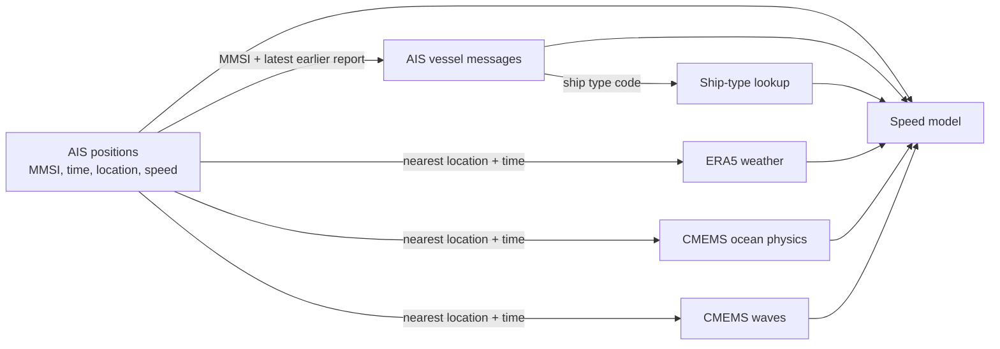

# Maritime Traffic & Environmental Performance Analytics

An end-to-end analysis of AIS vessel movements and local weather, ocean, and wave conditions in the English Channel. The project uses six selected tables from the MMDEC dataset and asks whether environmental information improves estimates of observed vessel speed for vessels the model has not seen before.

> **Main finding:** Adding wind, current, and wave measurements reduced mean absolute prediction error by 0.59% in the held-out-vessel comparison. This is a small incremental improvement in the current sample and method.

## Contents

- [Project at a glance](#project-at-a-glance)
- [Business question](#business-question)
- [Data selection and relationships](#data-selection-and-how-the-files-relate)
- [Data quality and cleaning](#data-quality-and-cleaning)
- [Exploratory analysis](#exploratory-analysis-and-relationships)
- [Hypotheses and model method](#hypotheses-and-model-method)
- [Model results and conclusion](#model-results)
- [Recommendations, limitations, and next steps](#recommendations-for-the-intended-use)
- [Repository contents and reproduction](#repository-contents)
- [Sources and citations](#sources-and-citations)
- [Data and code licensing](#data-and-code-licensing)

## Project at a glance

| Item | Definition |
|---|---|
| Practical user | Fleet operations or voyage performance analyst reviewing completed voyages |
| Decision supported | Which speed observations or route segments merit a closer human review |
| Outcome | AIS speed over ground (SOG), in knots; this is speed relative to Earth, not speed through water |
| Main approach | Compare two Ridge regression models: a context baseline and the same baseline with environmental features |
| Evaluation | Five 80/20 splits grouped by MMSI, so one vessel's reports do not appear in both training and test sets |
| Scope | Retrospective screening and context. The result is not a safe-speed recommendation and does not estimate fuel, emissions, or engine performance |

## Business question

Weather, sea state, traffic, vessel type, manoeuvring, and schedule can all be relevant when reviewing a vessel's speed. The available files do not identify why a vessel selected a particular speed. This study therefore asks a narrower, measurable question:

**Do wind, current, and wave conditions improve estimates of observed vessel speed over ground after vessel category, broad location, time, and local AIS traffic are taken into account?**

A fleet or voyage performance analyst could use a context-aware reference to find recurring slow-speed areas or observations that differ from the surrounding pattern, then check the voyage, weather, traffic, manoeuvring, schedule, and data quality. A model flag is a prompt for review, not evidence of underperformance or the cause of a speed change. IMO guidance discusses weather routing and speed management as operational practices; this project tests a data-analysis question and does not measure their benefits ([IMO weather routing](https://greenvoyage2050.imo.org/technology/weather-routing/), [IMO speed management](https://greenvoyage2050.imo.org/technology/speed-management/)).

## Data selection and how the files relate

The source is the publicly accessible [MMDEC Zenodo record](https://doi.org/10.5281/zenodo.17491518), which covers multiple maritime, satellite, and environmental sources. The authors describe MMDEC as a resource for teaching and research. This project uses six local files from that larger collection ([dataset paper](https://pmc.ncbi.nlm.nih.gov/articles/PMC12969038/)). The AIS and environmental tables cover July–September 2023; the local AIS file also contains a small number of reports from June 30. Counts below show source rows and source columns; the clean AIS copies contain 18,973,676 AIS position rows and 13,547,406 AIS vessel-message rows.

| File / table | Source rows × columns | What it contains | How it is used |
|---|---:|---|---|
| `Dataset_AIS_POS.parquet` | 19,014,229 × 14 | AIS position reports: MMSI, time, latitude/longitude, SOG, course, navigation status, and message fields | Main observation table and speed outcome |
| `Dataset_AIS_SPEC.parquet` | 13,558,007 × 19 | Repeated vessel-information messages: ship type, dimensions, draught, destination, ETA, and identifiers | Adds vessel type using MMSI and the latest earlier report |
| `Dataset_AIS_ShipTypes.csv` | 256 × 3 | Lookup from numeric AIS ship-type code to a broad description | Decodes `AIS_SPEC.ShipType` |
| `Dataset_ERA5.parquet` | 537,510 × 11 | Atmospheric grid values, including pressure, cloud cover, air temperature, and 10 m wind components | Adds weather near each AIS position and time |
| `Dataset_CMEMS_PHY.parquet` | 5,007,803 × 10 | Near-surface ocean values, including temperature, salinity, sea level, and east/north current components | Adds ocean context and course-relative current features |
| `Dataset_CMEMS_WAV.parquet` | 1,670,779 × 23 | Wave heights, periods, directions, and related fields on a three-hour grid | Adds significant wave height and wave context |


### Data types and units used in the analysis

- **AIS positions:** timestamps, integer MMSI and message/status codes, Boolean position-accuracy flag, decimal-degree coordinates, and numeric SOG/COG/heading/turn-rate values. SOG is analyzed in knots; the clean fields translate valid source codes while retaining source columns.
- **AIS vessel messages:** timestamps and integer-coded identifiers/categories alongside text fields. Vessel dimensions are interpreted in metres and draught in metres; dimension sentinel codes and draught codes 0 (unavailable) and 255 (25.5 m or greater) are kept distinct from exact measurements. The ship-type lookup is categorical text keyed by integer code.
- **ERA5:** timestamp and decimal-degree grid coordinates with floating measurements: pressure in hPa, temperature in °C, wind in m/s, and the derived cloud fraction in 0–1. The local cloud-cover field is percent-scaled and is converted in a separate clean field.
- **CMEMS physics:** timestamp, shallow depth and decimal-degree grid coordinates with floating values: salinity, water temperature in °C, east/north currents in m/s, and sea-surface height in metres.
- **CMEMS waves:** timestamp and grid coordinates with floating values: wave heights in metres, periods in seconds, directions in degrees, and drift components in m/s. Directions wrap around at 360° and are not treated as ordinary linear measurements.

The source files store timestamps without timezone metadata. Analysis copies interpret the clock values as UTC without shifting them; that convention is documented in the [data inventory](docs/data_inventory.md). The six tables do not share a single join key. Vessel messages connect by MMSI and report time; the ship-type lookup connects by type code. Environmental values connect to a vessel report by nearest grid location and a bounded time match.



See the [data inventory](docs/data_inventory.md) for all fields, storage types, units, time and spatial coverage, linkage choices, and null counts.

## Data quality and cleaning

Raw files are preserved. Cleaning writes separate derived files and interpretation fields; original sensor values are retained for traceability. No general missing-value imputation or statistical clipping was applied.

| Dataset | Quality checks and finding | Treatment |
|---|---|---|
| AIS positions | 40,553 repeated `(MMSI, Date)` rows were identical across all fields. AIS Message Type 27 uses SOG value 63 for “unavailable” (22,106 reports); four more reports use the upper-censored 102.2-knot code. | Removed only confirmed duplicate events from the clean copy. Kept source codes and added flags; unavailable/censored values are blank only in the interpreted SOG field. The source SOG field has 53,172 nulls. |
| AIS vessel messages | 10,601 exact full-row repeats; 35 conflicting records remained on repeated MMSI/time/message keys. | Removed exact repeats only. Kept conflicting reports; attached vessel type with an earlier-report rule and retained report age. Name, IMO, draught, destination, and ETA are absent on about 68% of source rows. |
| Ship-type lookup | 256 unique codes; every observed AIS_SPEC type code maps to a label. | Used for labels; code 0 is treated as “not available,” not an ordinary vessel class. |
| ERA5 weather | No nulls in the measured source fields. Local cloud cover is scaled 0–100, although the paper describes a 0–1 fraction. | Kept source values and added a cloud fraction field divided by 100. |
| CMEMS ocean physics | 402,038 nulls per measurement field (8.03%), all from 182 grid locations that are masked throughout the period. | Preserved the fixed spatial mask; did not fill it. |
| CMEMS waves | Nulls follow fixed grid masks; `VMXL` is null in all 1,670,779 rows. | Preserved masked values and omitted only the all-null field from the clean analytical copy. |

Analysis timestamps are labelled UTC without shifting their stored clock values. COG and heading values outside the valid 0–359° range, and ROT code −128, are unavailable in the added clean fields while source values remain intact.

The statistical outlier checks compare values outside ±3 standard deviations (a six-standard-deviation-wide interval) with the 1.5×IQR rule. For cleaned AIS SOG, the rules flagged 1.48% and 4.76% of valid values, respectively. SOG is skewed toward zero, so these percentages are review counts, not error rates. No row was removed or capped because of either statistical rule.

A separate track screen found 81 short-gap position jumps above 40 knots across 69 MMSIs; five exceeded 60 knots and the largest implied speed was 71.76 knots. Another screen found 16 reports from four MMSIs with measured SOG above 40 knots while reported positions stayed within 100 m across multiple days. These are retained as review candidates. Only exact candidate records appearing in the matched model sample are excluded from the primary fit (one report in this run). See the [cleaning log](docs/cleaning_log.md) and the audit notebook for definitions and evidence.

## Exploratory analysis and relationships

The EDA notebooks use distributions, maps, time summaries, missingness checks, the two outlier rules, and Pearson and Spearman correlations where a numeric comparison is meaningful. Identifiers and category codes are not treated as measurements; angular wave directions are not put into ordinary correlation matrices because their values wrap around at 360°.

Some of the clearest within-product relationships are between measurements that describe related conditions: ERA5 surface pressure and mean sea-level pressure had Pearson correlation 0.94; near-surface air temperature and dew point had correlation 0.69. In the wave table, significant wave height and maximum wave height were almost perfectly correlated (about 1.00), while two wave-period measures correlated at 0.91. These are useful signs of overlap among candidate features, not independent evidence that one condition causes another. The environment correlations use a reproducible sample across locations and times, so geography and season may contribute to the patterns.

For the joined speed question, a reproducible 50,000-position sample was matched to all three environmental grids. At a 20 km maximum distance, 89.0% of the sample had all three fields within the time windows; this was 36.8% at 10 km and 98.1% at 30 km. Hourly ERA5 and CMEMS physics used a 30-minute time window; three-hourly wave records used 90 minutes. At 20 km, the sample included 18,241 reports above the 0.5-knot underway threshold. Pooled Spearman correlations with speed were:

| Environmental measure | Spearman correlation with SOG |
|---|---:|
| Wind speed | 0.134 |
| Current speed | 0.124 |
| Significant wave height | 0.187 |

These are weak positive associations. They are pooled across repeated vessel reports and do not adjust for vessel, route, time, or traffic. The 20 km limit is a working match rule; distances were kept and the 10–30 km coverage and correlation sensitivity was checked. The [relationship notebook](notebooks/04_relationships_and_match_coverage.ipynb) shows match distances, offsets, and the full comparison.

## Hypotheses and model method

The outcome is cleaned AIS SOG in knots for reports above 0.5 knots. This is a practical underway screen for the study, not a universal threshold.

- **Null hypothesis:** Adding wind, current, and wave features does not lower prediction error for held-out vessels.
- **Alternative hypothesis:** Adding those environmental features lowers prediction error for held-out vessels.

The baseline uses broad vessel type, 0.25° latitude/longitude cells, hour of day, month, and a local traffic count. Traffic is the number of distinct MMSIs seen in a 0.1° cell during an hour, calculated from the full AIS file. The expanded model adds wind speed, wind along/across the vessel's course, current speed, current along/across course, and significant wave height.

Both feature sets use Ridge regression with the same five grouped train/test splits. Each split holds out about 20% of MMSIs; the test set contains vessels not used for fitting. Numeric variables are standardized and categories are one-hot encoded inside a training pipeline, so preprocessing is fitted on training data only and then applied to the test data. The model comparison uses MAE, RMSE, and R². Ridge regularization was fixed at `alpha=10`; this first comparison did not tune the parameter or compare a broad set of algorithms. Regression fits the continuous speed outcome; classification or clustering would answer a different question.

The traffic count uses all AIS reports in each hour, including reports later in that hour. It is suitable as retrospective voyage context, but it would need an “available by this time” definition before use in live operations.

## Model results

The common complete-case model sample contained **18,110 reports from 8,621 MMSIs** after time and distance matching, the underway rule, and the exact-record quality review. The context-only and context-plus-environment models were tested on the same held-out vessels in each split.

| Metric (mean ± standard deviation across five splits) | Context only | Context + environment |
|---|---:|---:|
| MAE (knots) | 2.603 ± 0.031 | **2.588 ± 0.029** |
| RMSE (knots) | 3.728 ± 0.084 | **3.714 ± 0.082** |
| R² | 0.386 ± 0.020 | **0.391 ± 0.021** |

The environmental model had lower MAE in all five splits, but the average reduction was only **0.015 knots (0.59%)**. The directional result favors the alternative hypothesis, while its practical size is small. No formal significance test or confidence interval was calculated, so this should not be described as a statistically established improvement. On the present evidence, environmental values add little predictive value beyond the context baseline at this scale and resolution.

## Recommendations for the intended use

- Use the context model only as a post-voyage reference to help prioritize observations for review.
- Check a flagged segment against the full voyage track, local conditions, traffic, manoeuvring, schedule, and AIS quality before interpreting it.
- Do not convert this model output into a speed order, safety conclusion, efficiency rating, or fuel/emissions estimate.
- Before any live use, rebuild traffic using only reports available at the decision time and validate the model on later dates and another area.

## Conclusion and business use

This analysis provides a reproducible way to compare an observed speed with a broad reference built from vessel type, place, time, and traffic, then test whether environmental measurements improve that reference. In this sample they improved the score slightly, but not enough to claim a material operational benefit. For a voyage analyst, the useful outcome is a **screening workflow**: identify a segment for review, then bring in voyage-specific evidence before drawing a conclusion.

The analysis cannot infer that weather caused a speed change, establish that a vessel was inefficient, or translate the model error into fuel or emissions savings. Those questions need additional evidence such as vessel-specific fuel/engine data, route and schedule constraints, and validation against another period or area.

## Limitations and next steps

- The local AIS period is one quarter in 2023; the evaluation holds out vessels but not future dates or a separate geographic area.
- Nearest-grid matching averages conditions over products with different resolutions. It does not represent the exact conditions at a vessel's hull; match distances, time offsets, and the spatial cutoff affect coverage.
- AIS SOG is not speed through water. Vessel class is broad, and exact draught or destination is unavailable for many records.
- The linear Ridge comparison is an initial benchmark with a fixed regularization value. A later study could compare a small number of non-linear models and tune parameters using grouped validation.
- The full-hour traffic feature is retrospective. A real-time application would require an as-of traffic count and an evaluation that respects prediction time.
- The model and matching results need a later-period and/or cross-area check before wider operational use. No production deployment or model refresh cadence has been tested; a refresh should follow new data availability and validation, not an assumed calendar schedule.
- Fuel, emissions, engine load, and safe speed are outside the available data and study scope.

## Repository contents

- [Notebook 01: data audit and cleaning](notebooks/01_data_audit_and_cleaning.ipynb) — schemas, types, missing values, duplicate checks, and documented cleaning rules.
- [Notebook 02: AIS movement EDA](notebooks/02_ais_movement_eda.ipynb) — time and location coverage, reporting intervals, and movement summaries.
- [Notebook 03: EDA across all six datasets](notebooks/03_eda_all_six_datasets.ipynb) — distributions, outlier screens, correlations, and visual summaries.
- [Notebook 04: dataset relationships and matching](notebooks/04_relationships_and_match_coverage.ipynb) — joins, environmental match coverage, and speed associations.
- [Notebook 05: model comparison](notebooks/05_model_comparison.ipynb) — traffic feature, held-out-vessel regression, metrics, and review examples.
- [Data inventory](docs/data_inventory.md) — field meanings, units, row counts, data coverage, and links.
- [Cleaning log](docs/cleaning_log.md) — decisions and data-quality findings.
- [Cleaning script](scripts/clean_mmdec.py) and [track screening script](scripts/screen_tracks.py) — reproducible derived data and review files.
- [Environment specification](environment.yml) — Python and package versions.

## Reproducing the analysis

1. Download the six named files from the [MMDEC Zenodo record](https://doi.org/10.5281/zenodo.17491518) and place them in the project root. The source files and generated `data/processed/` directory are excluded from Git.
2. Create the Conda environment and regenerate cleaned data and quality-review files:

   ```bash
   conda env create -f environment.yml
   conda activate maritime-analytics
   python scripts/clean_mmdec.py
   python scripts/screen_tracks.py
   ```

3. Run notebooks 01 through 05 in order. Notebook 04 creates the matched sample consumed by notebook 05. The committed notebooks retain aggregate tables and charts, while saved outputs showing individual vessel reports have been removed. Running the notebooks locally with the source files reproduces those row-level previews.

## Sources and citations

The MMDEC description, study area, and source data are documented in the dataset record and paper:

> Averty, T., Nasios, I., Ray, C., & Piliouras, N. (2026). *MMDEC: Multimodal maritime dataset on the English channel*. Data in Brief, 65, 112629. [https://doi.org/10.1016/j.dib.2026.112629](https://doi.org/10.1016/j.dib.2026.112629). Dataset: [https://doi.org/10.5281/zenodo.17491518](https://doi.org/10.5281/zenodo.17491518).

The analysis also relies on the source-product and field documentation: [ERA5 hourly data (Copernicus Climate Change Service)](https://doi.org/10.24381/cds.adbb2d47), [Copernicus Marine physics product](https://doi.org/10.48670/moi-00016), [Copernicus Marine waves product](https://doi.org/10.48670/moi-00017), the [U.S. Coast Guard AIS specifications](https://www.navcen.uscg.gov/ais-messages), and the [IALA AIS guideline](https://www.iala.int/product/g1082/?download=true). The Message 27 SOG code interpretation uses the [USCG Message 27 specification](https://www.navcen.uscg.gov/sites/default/files/pdf/AIS/AIS_MSG27.pdf).

## Data and code licensing

The MMDEC files are publicly downloadable, and the authors describe the collection as an open-access research and teaching resource. The Zenodo record's [Rights section](https://zenodo.org/records/17491518) currently shows a License heading without a license value. The companion research article is open access under [CC BY-NC 4.0](https://creativecommons.org/licenses/by-nc/4.0/), but that license applies to the article; it should not be assumed to license every dataset file. Zenodo says the reuse conditions depend on the license attached to the specific record ([Zenodo guidance on licenses](https://support.zenodo.org/help/en-gb/2-content/21-can-i-get-permission-to-use-a-specific-record)).

This project uses the files as research inputs, cites the dataset and paper, and does not redistribute the raw files. The source record does not let us identify a blanket CC BY 4.0 or CC BY-NC 4.0 license for those files, and upstream components may have their own terms. **The project code and documentation do not yet have a repository license.** Keep the data citation separate from the license selected for original project material.

The committed notebooks retain aggregate findings and charts but omit saved outputs that show individual AIS reports, identifiers, or locations. The notebook code can display those examples when run locally with the source files. Raw Parquet/CSV files and generated processed data are excluded from Git.
